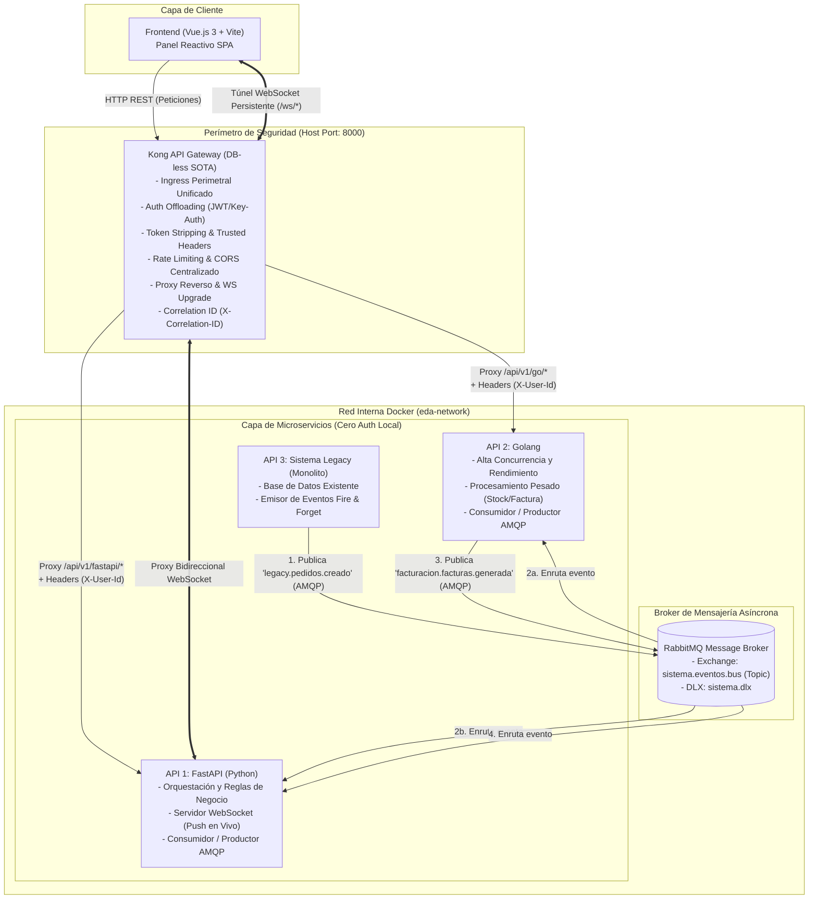
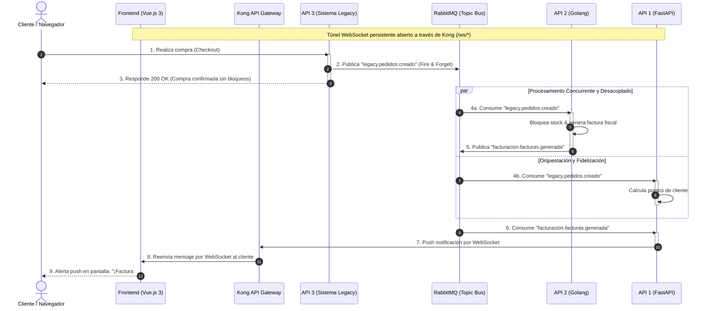

# 🚀 Demo: Migración a Arquitectura Orientada a Eventos (EDA) con Kong Gateway

Este repositorio contiene la prueba de concepto (Demo) para la transición de nuestra arquitectura monolítica actual hacia un ecosistema de microservicios independientes, escalables y asíncronos, utilizando **RabbitMQ** como columna vertebral de mensajería (*Message Broker*) y **Kong API Gateway** como puerta de enlace perimetral y gestor centralizado de autenticación.

El objetivo principal es demostrar cómo podemos crear nuevos sistemas modernos, reactivos y de alto rendimiento mientras mantenemos el sistema **Legacy** funcionando y aportando valor al nuevo ecosistema sin riesgo de romperlo.

---

## 🏗️ Arquitectura del Sistema

El sistema se compone de servicios completamente desacoplados, **100% contenerizados** y gobernados por dos pilares arquitectónicos fundamentales:

1. **Kong API Gateway (Perímetro de Ingress y Seguridad SOTA):**
   * Actúa como el único punto de entrada perimetral (`http://localhost:8000`) para el Frontend y consumidores externos.
   * **Principio de Cero Autenticación en APIs (Auth Offloading):** Ningún microservicio interno (FastAPI, Go) gestiona logins, contraseñas o validación de tokens JWT. Kong intercepta las peticiones, valida credenciales en el perímetro, elimina los tokens crudos sensibles (*token stripping*) e inyecta cabeceras HTTP de identidad verificada (`X-User-Id`, `X-User-Roles`).
   * **CORS y Rate Limiting Centralizados:** Kong mitiga abusos, previene saturación (DoS) y centraliza las políticas de orígenes cruzados.
   * **Trazabilidad Distribuida:** Genera o propaga la cabecera `X-Correlation-ID` en cada solicitud, asegurando auditoría extremo a extremo.
   * **Túnel de WebSockets Transparente:** Mantiene el canal bidireccional persistente entre el Frontend y FastAPI.

2. **RabbitMQ (Columna Vertebral de Eventos Asíncronos):**
   * Desacopla la lógica de negocio mediante un **Topic Exchange** (`sistema.eventos.bus`) y enrutamiento inteligente por *routing keys* (`[dominio].[entidad].[accion]`).
   * Permite que el sistema Legacy emita hechos (*Fire and Forget*) y que los microservicios modernos reaccionen concurrentemente sin bloquear al usuario ni depender de la disponibilidad inmediata de otros servicios.



---

## 📦 Descripción de los Servicios

### 1. Kong API Gateway (Puerta de Enlace Perimetral y Autenticación)
* **Rol:** Ingress, Reverse Proxy y Autenticación Centralizada (*Auth Offloading*).
* **Descripción:** Es el único punto de entrada público para el Frontend y clientes externos (puerto `8000`). Se ejecuta en modo declarativo (*DB-less*) con `kong.yml`.
* **Cero Auth en APIs downstream:** Las APIs internas (`api-fastapi`, `api-go`) **no implementan autenticación** en su código. Kong valida credenciales/tokens en el perímetro y propaga cabeceras HTTP de confianza (`X-User-Id`, `X-User-Roles`) hacia los microservicios. También gestiona el proxy transparente para conexiones WebSocket.

### 2. API 1 (FastAPI - Python)
* **Rol:** Consumidor / Productor (Orquestación de Negocio y Notificaciones).
* **Descripción:** Desarrollada en FastAPI y documentada con OpenAPI/Swagger. Carece de lógica de autenticación (confía en Kong). Mantiene conexiones **WebSocket** con el Frontend para empujar notificaciones en tiempo real cuando se procesan eventos relevantes en el ecosistema.

### 3. API 2 (Golang)
* **Rol:** Consumidor / Productor (Microservicio de Alto Rendimiento).
* **Descripción:** Desarrollada en Go y documentada con OpenAPI. Carece de lógica de autenticación. Se encarga de procesos críticos en concurrencia y velocidad (bloqueo atómico de inventario en milisegundos, cálculos fiscales y generación de facturas).

### 4. API 3 (Sistema Legacy)
* **Rol:** Productor de eventos primario.
* **Descripción:** Representa nuestro sistema actual monolítico. Se ha instrumentado para que, tras confirmar una transacción (ej. compra de pedido), emita un evento asíncrono a RabbitMQ (*Fire and Forget*) sin bloquear la respuesta al usuario.

### 5. Frontend (Vue.js 3 + Vite + Vuetify)
* **Rol:** Interfaz de Usuario Reactiva (SPA).
* **Descripción:** Consume las APIs a través del Gateway de Kong. Se suscribe a eventos push vía WebSockets con FastAPI (a través de Kong) para actualizar la interfaz al instante sin realizar *polling*.

### 6. RabbitMQ (Message Broker)
* **Rol:** Columna vertebral de eventos (AMQP).
* **Descripción:** Enruta mensajes mediante un Topic Exchange (`sistema.eventos.bus`) con soporte de Dead Letter Exchange (`sistema.dlx`). Garantiza que si un servicio está temporalmente caído, los mensajes se encolan de forma segura y se procesan al reactivarse.

---

## 🛠️ ¿Cómo se adaptó el Sistema Legacy a esta arquitectura?

Para integrar el sistema Legacy **sin reescribirlo y sin comprometer su estabilidad**, aplicamos el patrón *Strangler Fig* y *Event Interception*:

1. **Invasión Mínima:** Solo se añadieron llamadas asíncronas ligeras al final de las transacciones exitosas del Legacy (ej. justo después del `COMMIT` en la base de datos).
2. **Cero Bloqueo (Fire and Forget):** El Legacy no espera a que FastAPI o Go procesen el mensaje. Solo publica el evento `"legacy.pedidos.creado"` al broker y responde `200 OK` al usuario de inmediato.
3. **Tolerancia a Fallos:** Si RabbitMQ no estuviera disponible, un bloque `try/catch` previene que la petición original del usuario falle, registrando el incidente o almacenándolo localmente para reintento.
4. **Migración Progresiva:** Permite desacoplar módulos del Legacy paso a paso. Las tareas pesadas y las notificaciones pasan a ser responsabilidad de microservicios independientes.

---

## 💡 Caso de Uso Real: Procesamiento de Pedido y Notificaciones en Tiempo Real

Para demostrar el valor de esta arquitectura, la demo simula una compra realizada en el sistema Legacy y cómo el ecosistema moderno reacciona de forma asíncrona, paralela y en tiempo real.

### Flujo de Datos Paso a Paso



### Responsabilidades por Servicio en la Demo

#### 1. API 3 (Sistema Legacy) - Entrada del Pedido
* **Acción:** Un cliente realiza una compra. El Legacy guarda la orden en su base de datos monolítica.
* **Emisión EDA:** Publica de inmediato el evento al broker y responde `200 OK` al cliente.
* **Payload emitido:**
```json
{
  "event_id": "c4b8e920-7f24-49c1-8411-9e2c608cb174",
  "timestamp": "2026-09-12T10:30:00Z",
  "type": "legacy.pedidos.creado",
  "data": {
    "pedido_id": "ORD-8812",
    "cliente_id": "cli-442",
    "total": 299.99,
    "items": [
      {"sku": "PROD-A", "cantidad": 2, "precio": 149.99}
    ]
  }
}
```

#### 2. API 2 (Golang) - Alta Concurrencia (Inventario y Facturación)
* **Acción:** Escucha el tópico `legacy.pedidos.creado` mediante su cola `api-go.procesamiento_inventario`. Ejecuta el bloqueo de stock en almacenes en milisegundos y genera la factura fiscal.
* **Emisión EDA:** Al finalizar, publica el evento con routing key `facturacion.facturas.generada` de vuelta a RabbitMQ.

#### 3. API 1 (FastAPI) - Orquestación y Notificaciones
* **Acción A:** Escucha `legacy.pedidos.creado` para calcular asíncronamente puntos de fidelidad y recomendaciones.
* **Acción B:** Escucha `facturacion.facturas.generada` (emitido por la API de Go). Al recibirlo, empuja una notificación push a través del WebSocket abierto con el cliente.

#### 4. Kong API Gateway - Seguridad y Enrutamiento Perimetral
* **Acción:** Intercepta la conexión WebSocket inicial del Frontend, valida el token de autenticación del usuario, inyecta los encabezados de identidad y establece el túnel bidireccional con FastAPI.

#### 5. Frontend (Vue.js 3) - Experiencia Reactiva
* **Acción:** El usuario navega en el panel de control después de su compra.
* **Resultado:** Sin recargar la página ni realizar *polling*, recibe un aviso push instantáneo:
  > *"¡Tu pedido #ORD-8812 ha sido procesado! Factura fiscal #FAC-2026 generada y lista para descargar."*

---

## 🎯 Beneficios Clave de esta Arquitectura

1. **Velocidad y Desahogo para el Legacy:** El sistema antiguo no pierde tiempo calculando facturas, bloqueando inventarios complejos ni enviando notificaciones; atiende la transacción principal y queda libre.
2. **Cero Lógica de Auth Duplicada:** Los desarrolladores de FastAPI y Go no pierden tiempo implementando JWT o login en cada API; Kong se encarga del perímetro y la seguridad.
3. **Aislamiento de Fallos (Resiliencia):** Si la API en Go se reinicia o satura, el Legacy sigue procesando compras sin interrupción. Los mensajes se encolan en RabbitMQ y se consumen al recuperarse el servicio.
4. **Evolución Modular (Plug & Play):** Incorporar un nuevo microservicio (ej. Notificaciones por SMS en Node.js o ingesta a Data Lake) solo requiere suscribirse a RabbitMQ, sin tocar una sola línea de código existente.

---

## 🚀 Cómo Levantar y Probar el Ecosistema

Todo el sistema está 100% dockerizado y se orquesta de forma centralizada desde la raíz mediante Docker Compose, conforme a las reglas descritas en [`AGENTS.md`](./AGENTS.md).

> [!TIP]
> **¿Vas a presentar esta arquitectura a tu equipo o gerencia?**  
> Consulta la [**Guía de Demostración Ejecutiva y Técnica (`docs/DEMO_GUIDE.md`)**](./docs/DEMO_GUIDE.md) con un guión cronológico paso a paso, narrativa recomendada y demostración en vivo de resiliencia ante caídas del broker.

### Prerrequisitos
* [Docker Desktop](https://www.docker.com/) o Docker Engine con Docker Compose V2 instalado.

### 1. Clonar y Configurar Entorno
```bash
# Copiar plantilla de variables de entorno
cp .env.example .env
```

### 2. Levantar Todos los Servicios
```bash
# Construir imágenes y levantar en segundo plano
docker compose up --build -d
```

### 3. URLs y Accesos del Ecosistema

| Servicio | URL / Endpoint | Descripción |
| :--- | :--- | :--- |
| **Frontend (Vue.js SPA)** | [http://localhost:5173](http://localhost:5173) | Panel reactivo de usuario y visualización de eventos |
| **Kong API Gateway (Proxy)** | [http://localhost:8000](http://localhost:8000) | Punto de entrada perimetral unificado (REST y WebSockets) |
| **RabbitMQ Management Console** | [http://localhost:15672](http://localhost:15672) | UI de inspección de exchanges y colas (`guest` / `guest`) |
| **API 1: FastAPI Swagger (vía Kong)**| [http://localhost:8000/api/v1/fastapi/docs](http://localhost:8000/api/v1/fastapi/docs) | Documentación interactiva (Fidelidad / WebSockets) |
| **API 2: Go Swagger (vía Kong)** | [http://localhost:8000/api/v1/go/docs](http://localhost:8000/api/v1/go/docs) | Documentación interactiva (Inventario / Facturación) |
| **API 3: Legacy Swagger (vía Kong)** | [http://localhost:8000/api/v1/legacy/docs](http://localhost:8000/api/v1/legacy/docs) | Documentación interactiva (Compras Legacy) |
| **Colección Postman** | [`eda-demo.postman_collection.json`](./eda-demo.postman_collection.json) | Peticiones preconfiguradas para simular APIs externas B2B |
| **Kong Admin API** | [http://localhost:8001](http://localhost:8001) | Inspección de configuración declarativa del Gateway |

### 4. Ejecución de Pruebas Unitarias en Contenedores (TDD)
No requieres instalar Python, Go ni Node.js en tu máquina anfitriona:
```bash
# Pruebas unitarias de Legacy (Pytest) -> 4/4 passing
docker compose run --rm legacy-service pytest

# Pruebas unitarias de Go (Go test) -> 8/8 passing
docker compose run --rm api-go go test -v ./...

# Pruebas unitarias de FastAPI (Pytest-asyncio) -> 9/9 passing
docker compose run --rm api-fastapi pytest

# Pruebas unitarias del Frontend (Vitest) -> 5/5 passing
docker compose run --rm frontend-vue npm test
```

### 5. Monitoreo y Detención
```bash
# Ver estado de salud de todos los contenedores
docker compose ps

# Inspeccionar logs en vivo de un servicio específico
docker compose logs -f api-fastapi
docker compose logs -f api-go
docker compose logs -f legacy-service
docker compose logs -f kong
docker compose logs -f rabbitmq

# Detener el ecosistema preservando los datos
docker compose down

# Reset completo (incluyendo colas persistentes de RabbitMQ)
docker compose down -v
```
